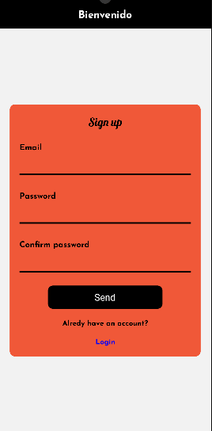

# Proyecto desarrollo de apps

Se realiza una aplicación con varias funciones utilizadas comunmente en aplicaciones E-commerce

## Funcionalidades Principales

### Registro e inicio de seisión

Esta función es creada para brindar una experiencia al usuario más personalizada, donde gracias a esto puede ingresar sus datos para poder hacer eso de funciones como guardar dirección de envío, visualizar las ordenes que ha hecho filtradas por su correo, agregar una imagén de perfil y acceder a las demás funciones que brinda la aplicación.

### Menú de funciones
Al ingresar podrás evidenciar un menú con las diferentes funciones para que puedas navegar en la app acorde a tus necesidades

### Productos
Dicha funcionalidad permite al usuario filtrar los productos acorde a la categoria de su interés, también le permite buscar algún producto en especifico con aydua de la barra buscador

### Detalle de producto
En esta pestaña podemos ver la descripción del producto, podemos seleccionar la cantidad deseada, dicha cantidad pide como minímo 1 y desactiva el botón incrementar al llegar al stock final del producto para evitar agregar más de los disponibles al carrito, cabe aclarar que el cuadro de texto permite agregar una cantidad con el teclado númerico si no se quiere usar los botones, con el botón de color negro "carrito" agregamos los productos

### Carrito de compras
Acá podemos revisar nuestra orden, el total unitario, total general, podemos vaciar nuestro carrito y enviar la orden al comercio

### Ordenes
Acá podemos revisar las ordenes que hemos hecho con nuestro correo

### Ordenes
En este sub menú podemos cambiar nuestra foto de perfil, actualizar nuestra ubicación
